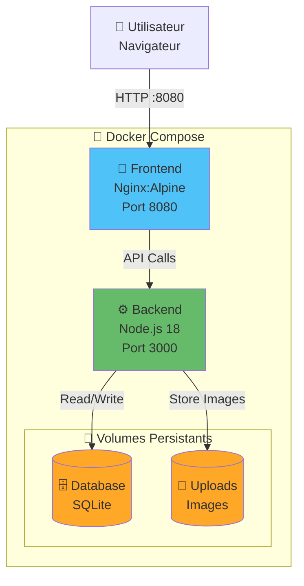

# 🐳 Voyage DZ - Guide Docker Complet

Guide complet pour lancer l'application Voyage DZ avec Docker : frontend (Nginx), backend (Node.js/Express) et base de données SQLite.

---

## 🏗️ Architecture Docker



---

## 🚀 Démarrage Rapide (3 Étapes)

### 1️⃣ Arrêter l'ancien conteneur (si déjà lancé)

```powershell
cd C:\Users\ibensari\.gemini\antigravity\scratch\voyage-dz
docker-compose down
```

### 2️⃣ Construire et lancer le stack complet

```powershell
docker-compose up -d --build
```

⏱️ **Durée** : ~2-3 minutes la première fois (construction des images)

### 3️⃣ Accéder à l'application

**Frontend** : http://localhost:8080  
**API Backend** : http://localhost:3000/api

---

## 🎯 Services Déployés

| Service | Container | Port | Description |
|---------|-----------|------|-------------|
| **Frontend** | `voyage-dz-frontend` | 8080 | Interface utilisateur (Nginx) |
| **Backend** | `voyage-dz-backend` | 3000 | API REST (Node.js/Express) |
| **Database** | Volume `voyage-dz-database` | - | SQLite (persistant) |
| **Uploads** | Volume `voyage-dz-uploads` | - | Images uploadées |

---

## 👥 Comptes de Démonstration

La base de données est initialisée avec 3 comptes de test :

| Rôle | Email | Mot de passe | Accès |
|------|-------|--------------|-------|
| 🔧 **Admin** | admin@voyagedz.com | admin123 | Accès complet à toutes les fonctionnalités |
| 🏠 **Hôte** | host@voyagedz.com | host123 | Créer et gérer des annonces |
| 👤 **Utilisateur** | ismael@example.com | user123 | Réserver et ajouter aux favoris |

---

## 📊 Données Pré-chargées

Au premier démarrage, la base de données est automatiquement initialisée avec :

- ✅ **3 villes** : Alger, Oran, Tlemcen
- ✅ **12+ listings** : Appartements, villas, activités, tours
- ✅ **20+ équipements** : WiFi, piscine, climatisation, etc.
- ✅ **3 utilisateurs** de test (admin, host, user)

---

## 🔍 Vérification du Déploiement

### Vérifier le statut des conteneurs

```powershell
docker-compose ps
```

✅ **Résultat attendu** : 2 conteneurs avec status "Up (healthy)"

```
NAME                   STATUS
voyage-dz-frontend     Up (healthy)
voyage-dz-backend      Up (healthy)
```

### Voir les logs en temps réel

**Tous les services** :
```powershell
docker-compose logs -f
```

**Backend uniquement** :
```powershell
docker-compose logs -f backend
```

**Frontend uniquement** :
```powershell
docker-compose logs -f frontend
```

### Tester l'API manuellement

```powershell
# Via PowerShell
Invoke-WebRequest -Uri "http://localhost:3000/api/cities" | Select-Object -Expand Content

# Via navigateur
# Ouvrir : http://localhost:3000/api/cities
```

✅ **Résultat attendu** : Liste JSON des 3 villes (Alger, Oran, Tlemcen)

---

## 💾 Persistance des Données

### Volumes Docker

Les données sont stockées dans des **volumes Docker persistants** :

```powershell
# Lister les volumes
docker volume ls | findstr voyage-dz

# Inspecter le volume de la base de données
docker volume inspect voyage-dz-database

# Inspecter le volume des uploads
docker volume inspect voyage-dz-uploads
```

### Important ⚠️

- ✅ Les données **PERSISTENT** même après `docker-compose down`
- ✅ Utilisateurs, réservations, favoris sont **SAUVEGARDÉS**
- ❌ Pour supprimer toutes les données : `docker-compose down -v` (⚠️ Irréversible !)

---

## 🔧 Commandes Utiles

### Gestion du Stack

```powershell
# Démarrer les services
docker-compose up -d

# Arrêter les services (données conservées)
docker-compose down

# Redémarrer un service spécifique
docker-compose restart backend

# Reconstruire les images
docker-compose up -d --build

# Voir l'utilisation des ressources
docker stats
```

### Debugging

```powershell
# Accéder au shell du backend
docker exec -it voyage-dz-backend sh

# Accéder au shell du frontend
docker exec -it voyage-dz-frontend sh

# Voir les derniers logs (100 lignes)
docker-compose logs --tail=100

# Suivre les logs en temps réel
docker-compose logs -f
```

### Nettoyage

```powershell
# Arrêter et supprimer les conteneurs (⚠️ DONNÉES CONSERVÉES)
docker-compose down

# Arrêter et supprimer TOUT (⚠️ DONNÉES PERDUES)
docker-compose down -v

# Nettoyer les images inutilisées
docker image prune -a

# Nettoyage complet Docker (⚠️ Attention)
docker system prune -a --volumes
```

---

## 🧪 Tests Fonctionnels

### Test 1 : Authentification

1. Ouvrir http://localhost:8080
2. Cliquer sur **"Connexion"**
3. Utiliser : `ismael@example.com` / `user123`
4. ✅ Vérifier : Connecté, nom affiché en haut

### Test 2 : Recherche et Navigation

1. Chercher **"Alger"** dans la barre de recherche
2. Cliquer sur une carte de listing
3. ✅ Vérifier : Page détails s'ouvre avec images, prix, équipements

### Test 3 : Favoris

1. Sur une page de listing, cliquer sur ❤️
2. Aller dans **"Mes Favoris"**
3. ✅ Vérifier : Le listing apparaît
4. Fermer le navigateur et rouvrir
5. ✅ Vérifier : Favori toujours présent (persistance)

### Test 4 : Mode Hôte

1. Se connecter avec `host@voyagedz.com` / `host123`
2. Aller dans **"Tableau de bord hôte"**
3. Cliquer sur **"Créer une annonce"**
4. ✅ Vérifier : Formulaire de création disponible

### Test 5 : API Backend

```powershell
# Test 1: Récupérer les villes
Invoke-WebRequest http://localhost:3000/api/cities

# Test 2: Récupérer les listings
Invoke-WebRequest http://localhost:3000/api/listings

# Test 3: Récupérer les équipements
Invoke-WebRequest http://localhost:3000/api/amenities
```

---

## 🐛 Dépannage

### Problème : Les conteneurs ne démarrent pas

**Solution** :
```powershell
# Voir les logs détaillés
docker-compose logs

# Reconstruire depuis zéro
docker-compose down
docker-compose build --no-cache
docker-compose up -d
```

### Problème : Port 8080 ou 3000 déjà utilisé

**Solution** :
```powershell
# Voir les processus occupant les ports
netstat -ano | findstr ":8080"
netstat -ano | findstr ":3000"

# Option 1: Arrêter le processus
taskkill /PID <PID> /F

# Option 2: Modifier les ports dans docker-compose.yml
# Changer "8080:80" en "8081:80" par exemple
```

### Problème : L'API ne répond pas

**Solution** :
```powershell
# Vérifier que le backend est "healthy"
docker-compose ps

# Vérifier les logs backend
docker-compose logs backend

# Redémarrer le backend
docker-compose restart backend
```

### Problème : Base de données corrompue

**Solution** :
```powershell
# ⚠️ ATTENTION : Cela supprime TOUTES les données
docker-compose down -v
docker-compose up -d
```

### Problème : Images ne se chargent pas

**Solution** :
```powershell
# Vérifier le volume uploads
docker volume inspect voyage-dz-uploads

# Recréer le volume si nécessaire
docker-compose down
docker volume rm voyage-dz-uploads
docker-compose up -d
```

---

## 🔄 Migration depuis localStorage

Si vous utilisiez l'ancienne version avec `localStorage` :

### Données à migrer manuellement :

❌ **Favoris** : Non migrables automatiquement (re-ajouter manuellement)  
❌ **Utilisateur** : Créer un nouveau compte via l'inscription  
❌ **Réservations** : Refaire les réservations  

### Avantages de SQLite vs localStorage :

| Fonctionnalité | localStorage | SQLite + Docker |
|----------------|--------------|-----------------|
| Persistance | ❌ Navigateur uniquement | ✅ Serveur + Volume |
| Multi-utilisateurs | ❌ Non | ✅ Oui |
| Authentification | ❌ Mock | ✅ JWT réel |
| Partage de données | ❌ Non | ✅ Oui |
| Backup | ❌ Difficile | ✅ Volume Docker |

---

## 📈 Monitoring

### Vérifier la santé des services

```powershell
# Voir le healthcheck du backend
docker inspect voyage-dz-backend | findstr Health

# Voir les ressources utilisées
docker stats voyage-dz-frontend voyage-dz-backend
```

### Métriques importantes

- **CPU** : < 10% en idle
- **RAM** : ~150-200 MB par conteneur
- **Disk** : ~500 MB (images) + données variables

---

## 🔐 Production (Déploiement)

### ⚠️ Avant de déployer en production

1. **Changer JWT_SECRET** dans `docker-compose.yml`
2. **Configurer HTTPS** (Nginx avec SSL)
3. **Limiter l'exposition des ports** (uniquement 8080 public)
4. **Activer les logs externes** (volumes ou service externe)
5. **Backup régulier** du volume `voyage-dz-database`

### Sauvegarder la base de données

```powershell
# Créer un backup
docker run --rm --volumes-from voyage-dz-backend -v ${PWD}:/backup alpine tar czf /backup/db-backup.tar.gz /app/database.sqlite

# Restaurer un backup
docker run --rm --volumes-from voyage-dz-backend -v ${PWD}:/backup alpine sh -c "cd /app && tar xzf /backup/db-backup.tar.gz --strip 1"
```

---

## 📚 Ressources

- **Docker Compose Docs** : https://docs.docker.com/compose/
- **Node.js Docker** : https://nodejs.org/en/docs/guides/nodejs-docker-webapp/
- **SQLite Docs** : https://www.sqlite.org/docs.html

---

## ✅ Checklist de Vérification

Avant de considérer que tout fonctionne :

- [ ] `docker-compose ps` montre 2 conteneurs "Up (healthy)"
- [ ] http://localhost:8080 affiche l'application
- [ ] http://localhost:3000/api/cities retourne du JSON
- [ ] Connexion avec `ismael@example.com` / `user123` fonctionne
- [ ] Recherche de listings fonctionne
- [ ] Ajout aux favoris fonctionne et persiste
- [ ] Mode hôte accessible avec `host@voyagedz.com`
- [ ] Logs visibles via `docker-compose logs`
- [ ] Données persistent après `docker-compose down` puis `up`

---

## 🎉 C'est Prêt !

Votre application **Voyage DZ** est maintenant dockerisée et prête pour le développement ou la production !

**Stack complet** :
- ✅ Frontend Nginx (PWA)
- ✅ Backend Node.js/Express (API REST)
- ✅ Base de données SQLite (persistante)
- ✅ Système d'authentification JWT
- ✅ Upload d'images
- ✅ Réseau isolé Docker

**Prochaines étapes** :
1. Tester toutes les fonctionnalités
2. Ajouter vos propres données (villes, listings)
3. Déployer sur un serveur (VPS, Cloud)

---

**Version** : 2.0.0 Docker  
**Créé** : Décembre 2024  
**Stack** : Docker + Nginx + Node.js + Express + SQLite  
**Containers** : 2 services  
**Volumes** : 2 volumes persistants

🇩🇿 **Bon développement avec Voyage DZ !** 🇩🇿
